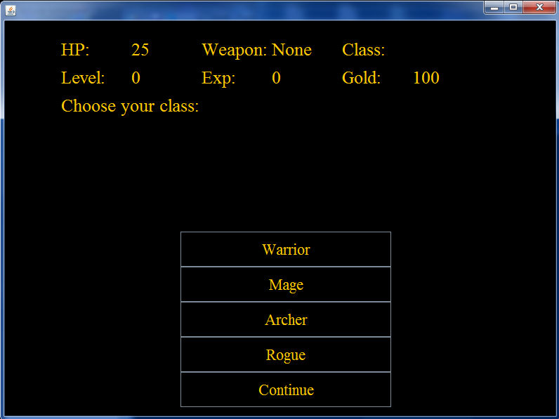
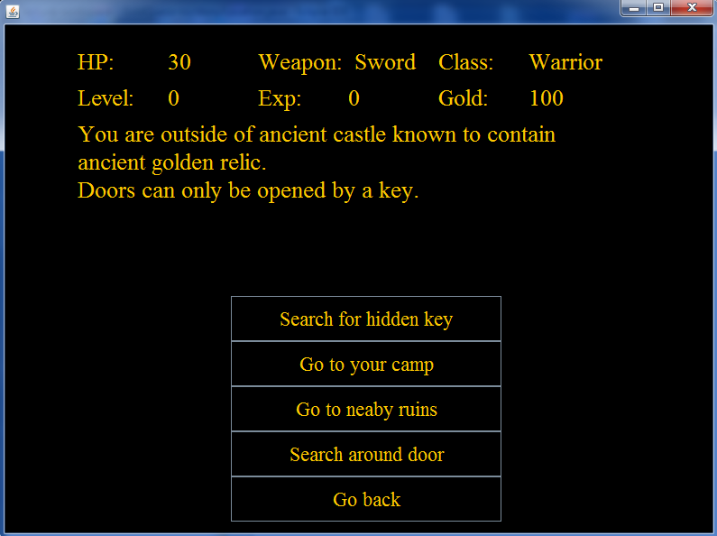
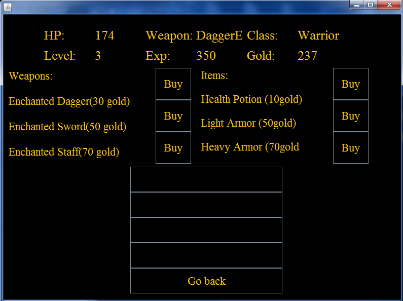
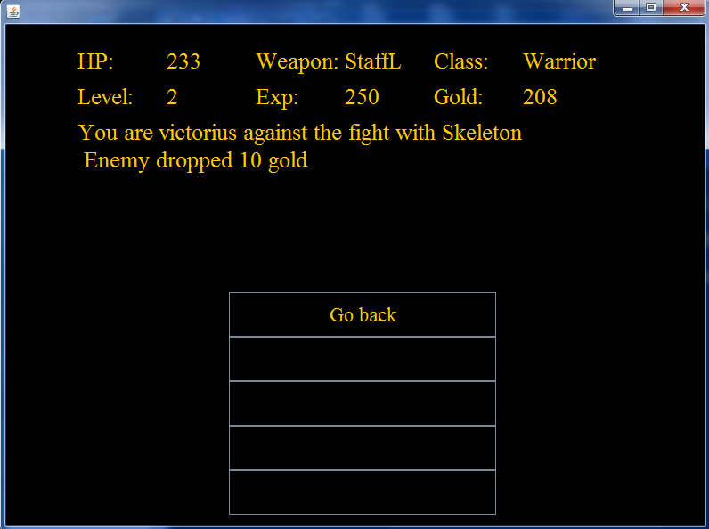

<h1>Gold Quest</h1> 

<h2>Description:</h2>

Gold Quest is adventure game build with Java with graphical user interface. Users can choose different classes, armors, weapons and go to multiple areas. Displays stats and contains inventory system which change depending how game is played.

<h2>Prerequisites</h2>

You must have Eclipse IDE installed

<h2>Screenshots<h2>
  <h3>Class Menu:</h3>
  
  <h3>Starting area:</h3>
  
    <h3>Buying items:</h3>
  
    <h3>Combat system:</h3>
  
  
